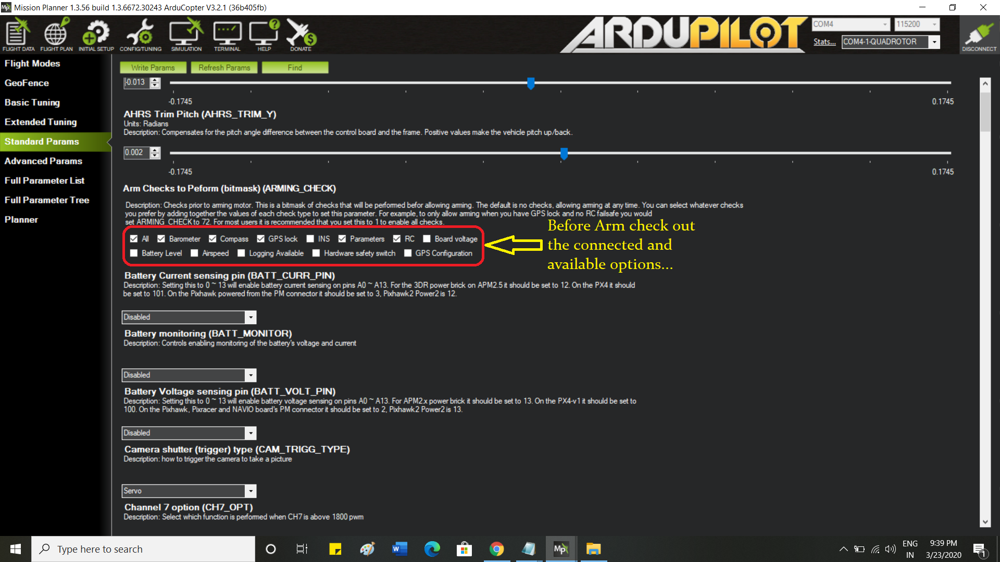

# Drone-setup-with-Ardupilot
Full setup guide for a Quad-copter using Ardupilot  (APM2.8).

# Guide & Caution

1. Any of the propeller should not attach during calibration.

2. During the RC calibration ... the switches and trimmer buttons 
   should be as it is.

3. GPS calibration should be done outside of the room. (at Sats: 14-15)

4. GPS stand have to use otherwise, there may occur interference error.

5. To fix CW and CCW rotation, interchange the red and black wire of the
   motor during *Motor test.

6. After calibration unplug & plug in the cable.

7. RED light glow continuously, when armed.

8. ESC should be good quality (30Amp min) otherwise drone will not stabilize
   properly. Automatically may move towards LEFT/RIGHT/FORWARD/BACKWARD 
   (even on Loiter mode).

9. Every time after Drone-crash recalibrate the drone before flying. 
   (Because after crashing there may occur memory loss of controller)

10.GPS_glitch is very problematic issue, due to this issue drone get wrong
   GPS value and to reach another position, the drone crash very badly. 
   To overcome the problem, sometimes we use two GPS (we have to check the 
   Flight controller support two GPS or not) or prime quality GPS.

# Recommended parts ..................................... our drone

 

# Wiring and Connections:

RC Controller Connection,

 

# Mission Planner setup:

Actual RC calibration

 

GPS calibration

 

Motor calibration

 

pre_arm messages

 

# ESE Calibration..
  .? link- https://youtu.be/z2G1P9bWM9w
  
# Reverse setup of Left_Right, Fw_Bk

# Propeller Setup:

  

For proper stabilization you may use Optical_Flow sensor .Connection of the sensor and for Camera Setup there is uploaded a file named "Sensors & Cam connection"

# !Ready to Flight!

Tower App(Telemetry)- https://www.apkmonk.com/download-app/org.droidplanner.android/4_org.droidplanner.android_2016-10-10.apk/

know more...https://ardupilot.org/planner/index.html
